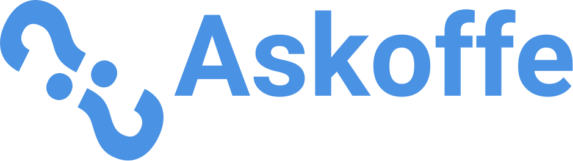
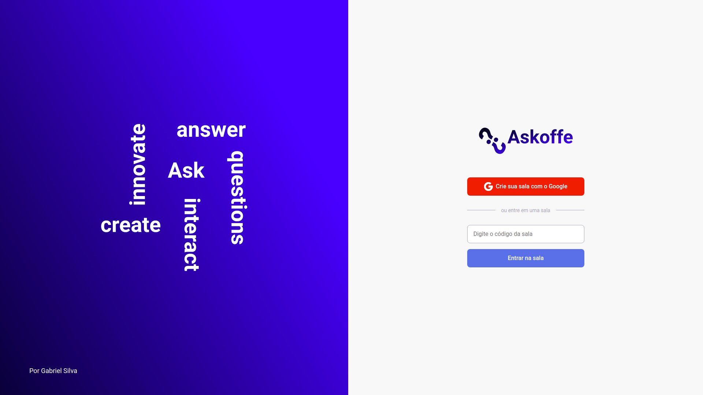
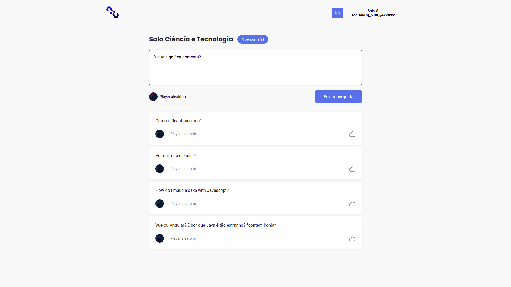
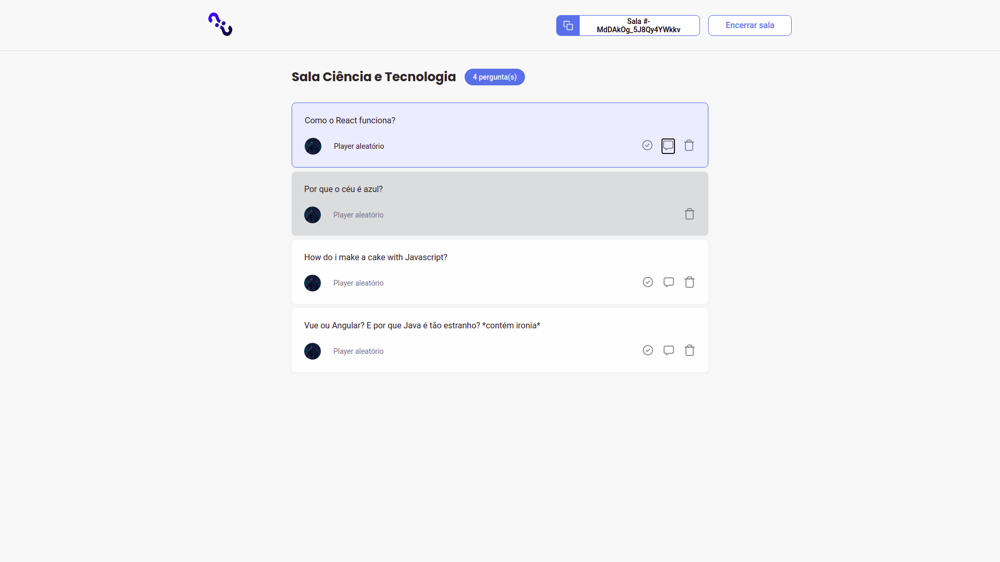

<p align="center">
  
</p>

<h1 align="center">
    
    <hr>
    
    <hr>
    
</h1>

<br>

## Create live Q&A rooms and answer your audience's questions in real-time

<br>

## 🧪 Technologies

This project was developed using the following technologies:

- [React](https://reactjs.org)
- [Firebase](https://firebase.google.com/)
- [TypeScript](https://www.typescriptlang.org/)

## 🚀 Getting started

Clone the project and access the folder.

```bash
$ git clone git@github.com:devzgabriel/letmeAsk.git
$ cd letmeask
```

Follow the steps below:

```bash
# Install the dependencies
$ yarn

# Start the project
$ yarn start
```

The app will be available for access on your browser at http://localhost:3000

## 🔖 Layout

You can view the `old` project layout through the links below:

- [Layout Web](https://www.figma.com/file/u0BQK8rCf2KgzcukdRRCWh/Letmeask/duplicate)

Remembering that you need to have a [Figma](http://figma.com/) account to access it.

## 📝 License

This project is licensed under the MIT License. See the [LICENSE](LICENSE.md) file for details.

---

<p align="center">Made with 💜 by Gabriel Silva and Rocketseat</p>
